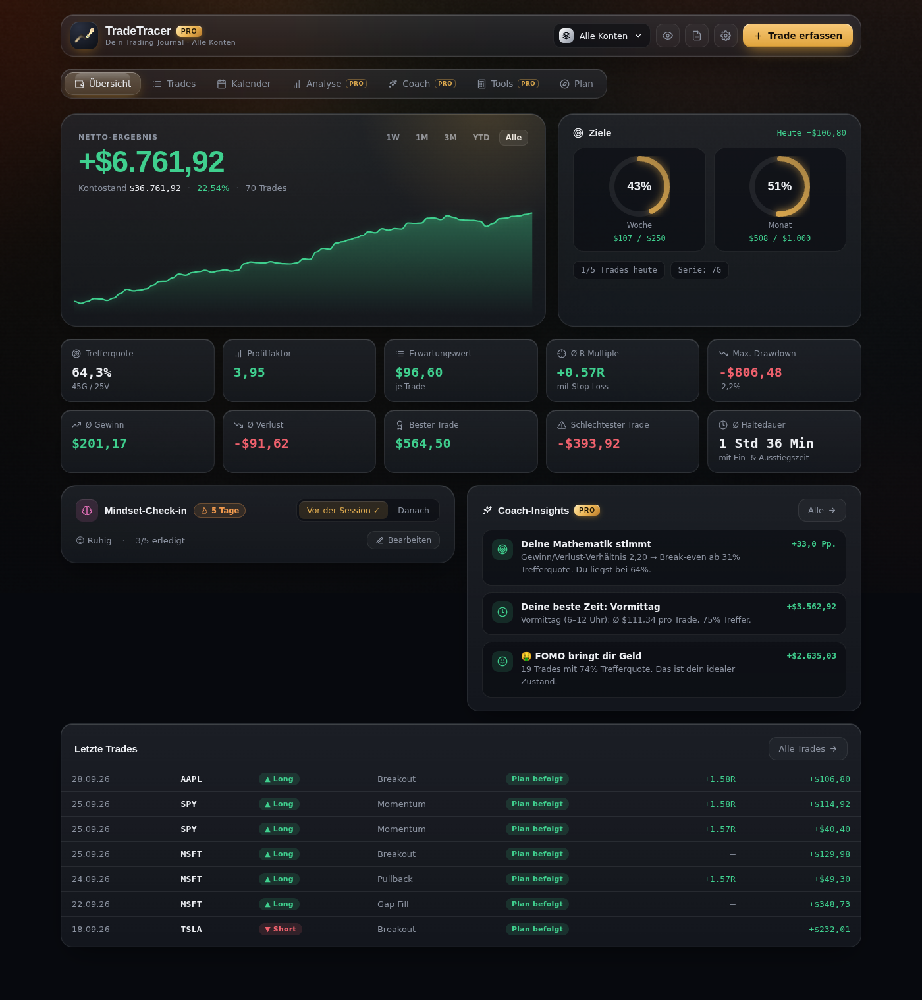
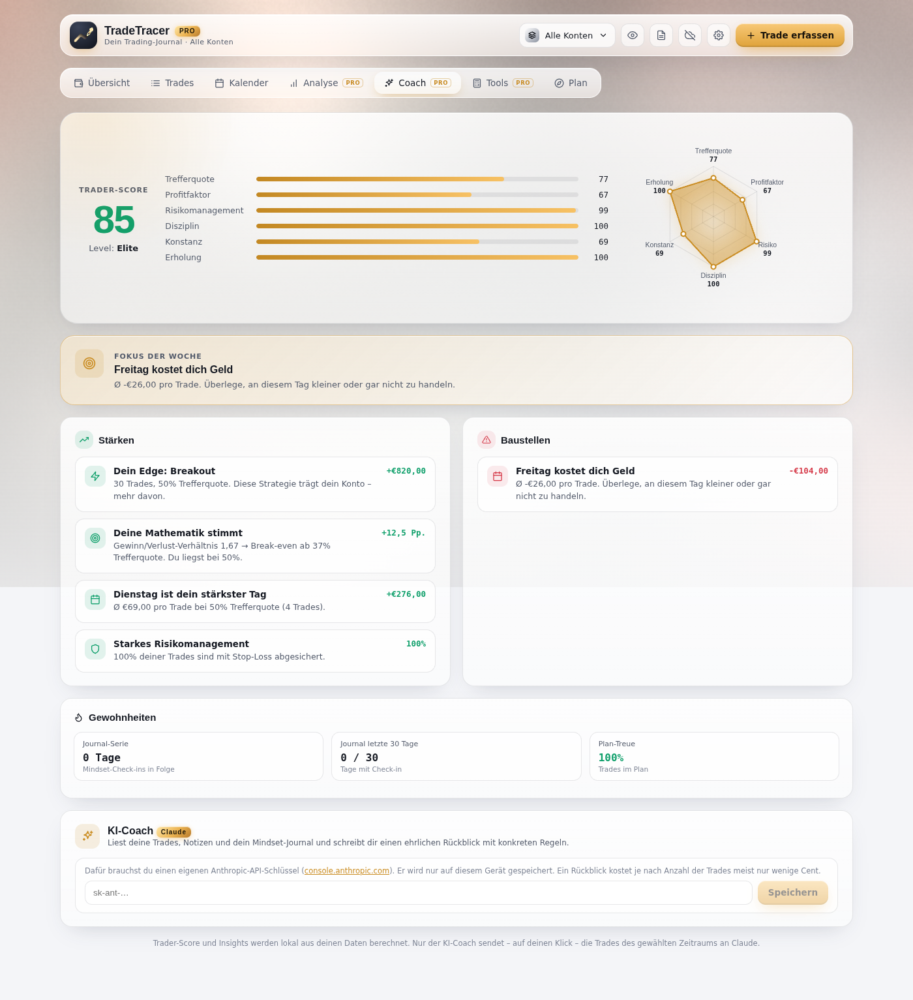
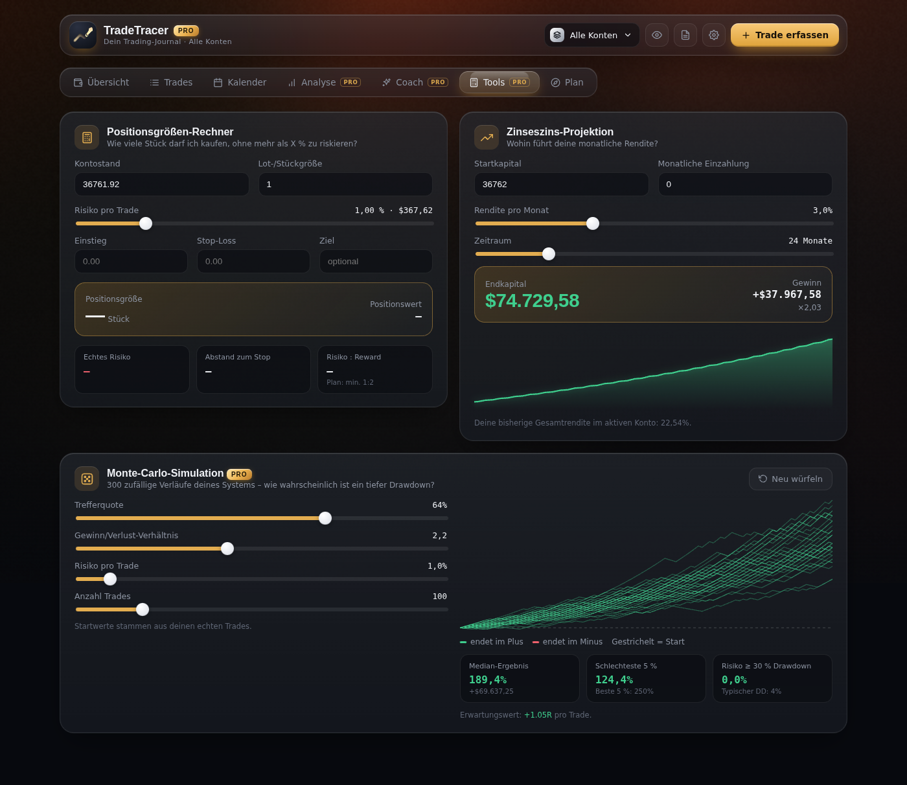
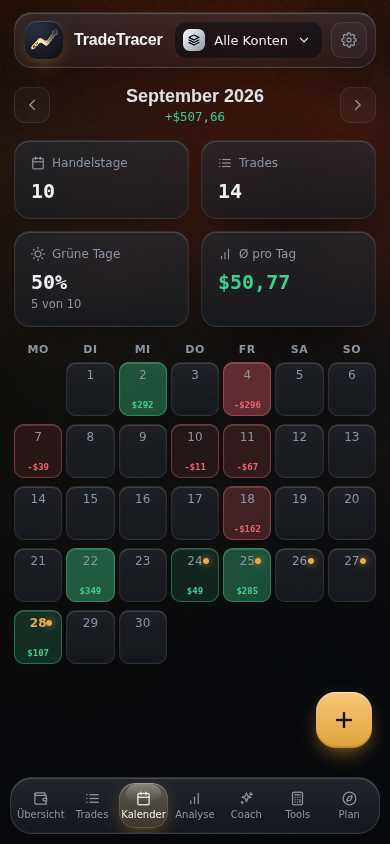

# TradeTracer PRO

Persönliches Trading-Journal als **eine einzige HTML-Datei** – öffnen, loslegen. Alle Daten bleiben lokal im Browser (localStorage + IndexedDB für Screenshots).

## Starten

`index.html` im Browser öffnen. Beim ersten Start braucht die App Internet, weil React, Babel und SheetJS von `cdn.jsdelivr.net` geladen werden.

Daten aus der Vorversion (`journal:trades`, `journal:plan`, `journal:mindset`, `journal:settings`) werden automatisch übernommen. Das bisherige Startkapital wird zum „Hauptkonto“.

## Auf mehreren Geräten nutzen (Sync)

TradeTracer synchronisiert PC, Handy und Tablet über ein **geheimes GitHub Gist** in deinem eigenen GitHub-Konto – ohne fremden Server.

**1. App online stellen (einmalig, damit sie auch auf dem Handy läuft)**
GitHub → Repo *TRADETRACER* → **Settings → Pages** → „Deploy from a branch“ → Branch wählen, Ordner `/ (root)` → Save.
Nach ~1 Minute läuft die App unter `https://matsdenninger-ui.github.io/TRADETRACER/`. Auf dem iPhone in Safari: Teilen → „Zum Home-Bildschirm“.

**2. Token erstellen (einmalig)**
[github.com/settings/tokens/new](https://github.com/settings/tokens/new?scopes=gist&description=TradeTracer%20Sync) → nur **gist** anhaken → „Generate token“ → kopieren.

**3. Auf jedem Gerät verbinden**
Einstellungen (Zahnrad) → **Geräte-Sync** → Token einfügen → „Verbinden“. Das erste Gerät legt das Gist an, alle weiteren finden es automatisch.

So funktioniert der Abgleich:
- Beim Öffnen, bei jeder Änderung, beim Zurückkehren in die App und jede Minute.
- Trades, Konten und Mindset-Einträge werden **einzeln** zusammengeführt (neuester Stand gewinnt), Löschungen werden an alle Geräte weitergegeben – offline erfasste Trades gehen nicht verloren.
- Screenshots werden mit übertragen.
- Nur pro Gerät bleiben: aktives Konto, Privatsphäre-Modus, animierter Hintergrund und der Token selbst.
- Das Wolken-Symbol im Header zeigt den Status (grün = synchron, rot = Fehler). Ein Klick synchronisiert sofort.

> Ein „geheimes“ Gist ist nicht öffentlich auffindbar, aber nicht verschlüsselt: Wer den genauen Link kennt, kann es lesen. Teile den Link und den Token mit niemandem.

## Premium-Funktionen (angelehnt an SuperTrader PRO)

| Funktion | Wo |
|---|---|
| **Mehrere Konten/Portfolios** mit eigenem Startkapital, Umschalter „Alle Konten“ | Header, Einstellungen |
| **Chart-Screenshots** pro Trade (Upload oder Einfügen per ⌘/Strg+V), Lightbox | Trade-Formular, Trade-Detail |
| **Trade-Detail-Ansicht** mit Preisleiter (SL / Einstieg / TP / Ausstieg), Haltedauer, Duplizieren | Klick auf einen Trade |
| **Emotion beim Einstieg**, Sterne-Bewertung der Ausführung, eigene Tags, Take-Profit, Ausstiegszeit | Trade-Formular |
| **Profi-Kennzahlen**: Sharpe, Sortino, SQN, Kelly, Gewinn/Verlust-Verhältnis, Recovery Factor, Drawdown in % | Analyse |
| **R-Verteilung**, **Monats-Heatmap**, Long vs. Short, Auswertung nach Haltedauer, Emotion, Tags, Bewertung | Analyse |
| **Coach**: Trader-Score (6 Dimensionen, Radar), automatische Insights ab 10 Trades, „Fokus der Woche“ | Coach |
| **Positionsgrößen-Rechner**, **Zinseszins-Projektion**, **Monte-Carlo-Simulation** | Tools |
| **Ziele**: Wochen-/Monatsziel als Fortschrittsringe, Zeitraum-Filter für die Equity-Kurve | Übersicht |
| **P&L-Kalender** mit Wochensummen, Monatsstatistik, Journal-Markierungen | Kalender |
| **Performance-Report** (Woche/Monat/Jahr) – druckbar bzw. als PDF speicherbar | Header → Report |
| **Privatsphäre-Modus** blendet alle Beträge aus | Auge-Symbol oder Taste `P` |
| Journal-Serie, Backup inkl. Screenshots, Tastenkürzel (`N`, `1–7`, `P`, `Esc`) | überall |

Der Coach arbeitet regelbasiert auf deinen eigenen Daten – es wird nichts an einen Server geschickt.

| Coach | Tools | Mobil |
|---|---|---|
|  |  |  |

## Design

- **Shader-Gradient-Hintergrund** – WebGL-Portierung des Noise-Displacement-Gradients aus [`shadergradient`](https://github.com/matsdenninger-ui/shadergradient), eingefärbt mit der Akzentfarbe, ~30 fps bei reduzierter Auflösung, pausiert im Hintergrund-Tab, abschaltbar.
- **Liquid-Metal-Logo** – der Fragment-Shader und die Poisson-Kantenkarte aus [`liquid-logo`](https://github.com/matsdenninger-ui/liquid-logo), angewendet auf das Trend-Pfeil-Logo.
- **Liquid Glass** – Glasflächen, Specular-Kanten und die federnde Tab-Pille nach dem Vorbild von [`liquid-glass-js`](https://github.com/matsdenninger-ui/liquid-glass-js); umgesetzt mit CSS (`backdrop-filter`), weil die html2canvas-Refraktion für eine Daten-App zu teuer wäre.
- Mobil: Glas-Tab-Leiste unten, schwebender „+“-Button, Detail als Bottom-Sheet.
- `prefers-reduced-motion` wird respektiert.
