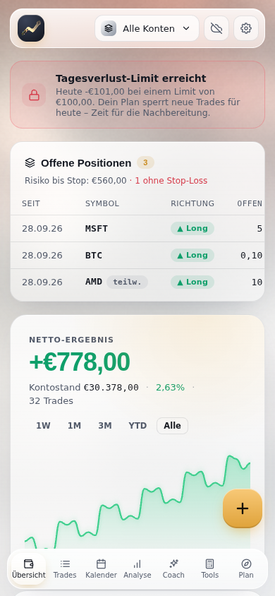

# TradeTracer PRO

Persönliches Trading-Journal als **Web-App** – läuft im Browser, lässt sich auf dem Handy wie eine App installieren, funktioniert **offline** und synchronisiert auf Wunsch **Ende-zu-Ende-verschlüsselt** zwischen deinen Geräten.


## Schnellstart

- **Einfach öffnen:** `index.html` im Browser öffnen – fertig. Die Datei enthält alles, was zum Start nötig ist (auch ohne Internet).
- **Als App auf Handy & PC:** über GitHub Pages bereitstellen (siehe unten) und die Seite „zum Home-Bildschirm hinzufügen“ bzw. im Browser „installieren“.

Daten aus älteren Versionen werden automatisch übernommen.

## Einrichtung (einmalig)

### 1. App online stellen – Vercel oder GitHub Pages
**Vercel** (bereits verbunden): baut automatisch bei jedem Push. Die `vercel.json` sorgt dafür, dass die fertigen Dateien direkt ausgeliefert werden (kein Build auf Vercel nötig). Die Adresse findest du im Vercel-Dashboard unter *Domains*.

**Alternativ GitHub Pages:**
GitHub → Repo **TRADETRACER** → **Settings → Pages** → „Deploy from a branch“ → Branch wählen, Ordner `/ (root)` → **Save**.
Nach ~1 Minute läuft die App unter `https://matsdenninger-ui.github.io/TRADETRACER/`.

Wichtig: Nutze **eine** feste Adresse. Jede Adresse hat ihren eigenen Browser-Speicher – über den Geräte-Sync kommen deine Daten aber auf jede Adresse.

- **iPhone/iPad:** in Safari öffnen → Teilen → **„Zum Home-Bildschirm“**
- **Android:** in Chrome öffnen → Menü → **„App installieren“**
- **PC/Mac:** in Chrome/Edge → Symbol in der Adressleiste → **„Installieren“**

Danach startet TradeTracer auch ohne Internet. Neue Versionen werden automatisch geladen („Neue Version verfügbar – Neu laden“).

### 2. Geräte-Sync (optional)
1. Token erstellen: [github.com/settings/tokens/new](https://github.com/settings/tokens/new?scopes=gist&description=TradeTracer%20Sync) → nur **gist** anhaken → „Generate token“.
2. In TradeTracer: Zahnrad → **Geräte-Sync** → Token einfügen, **Sync-Passwort** festlegen → „Verbinden“.
3. Auf jedem weiteren Gerät: denselben Token **und dasselbe Sync-Passwort** eingeben.

So funktioniert es:
- Daten liegen in einem **geheimen Gist** in deinem GitHub-Konto, mit AES-256 verschlüsselt. Den Schlüssel erzeugt die App aus deinem Sync-Passwort; das Passwort verlässt nie das Gerät. Ohne Passwort ist das Gist nur Zeichensalat – auch für jemanden mit Link oder Token.
- **Passwort ändern:** Auf einem Gerät, das noch synchronisiert: Zahnrad → Geräte-Sync → **„Sync-Passwort ändern“**. Alles wird mit dem neuen Passwort neu verschlüsselt; die anderen Geräte melden „gesperrt“ und brauchen einmal das neue Passwort.
- **Passwort vergessen?** Ist noch ein Gerät verbunden, dort einfach ein neues Passwort setzen (siehe oben). Ist keins mehr verbunden: auf dem Gerät mit den meisten Trades Zahnrad → Geräte-Sync → **„Passwort vergessen?“** → neues Passwort → „Mit neuem Passwort neu starten“. Der Stand dieses Geräts wird zum neuen Sync-Stand; auf den anderen Geräten das neue Passwort eingeben, ihre Trades werden wieder dazugemischt.
- **Neuer GitHub-Token?** Zahnrad → Geräte-Sync → „Neuen GitHub-Token eintragen“ – das Passwort bleibt gleich.
- Jeder Trade wird einzeln abgeglichen (neuester Stand gewinnt), Löschungen werden weitergegeben, offline erfasste Trades gehen nicht verloren.
- **Screenshots** liegen je in einem eigenen geheimen Gist („TradeTracer Screenshot …“ – bitte nicht löschen) und werden auf anderen Geräten erst geladen, wenn du sie ansiehst.
- Auf dem Gerät bleiben: Token, Schlüssel, aktives Konto, Privatsphäre-Modus, Design und Hintergrund-Animation.
- Hinweis: Der GitHub-Token liegt im Browser-Speicher des Geräts. Gib ihm nur die Berechtigung **gist**.

### 3. KI-Coach (optional)
Coach-Tab → **KI-Coach** → eigenen [Anthropic-API-Schlüssel](https://console.anthropic.com/settings/keys) eintragen (bleibt auf dem Gerät). Auf Klick schickt die App die Trades, Notizen und Mindset-Einträge des gewählten Zeitraums an Claude und bekommt einen ehrlichen Rückblick mit konkreten Regeln zurück. Screenshots werden nicht gesendet. Ein Rückblick kostet meist nur wenige Cent (Abrechnung über dein Anthropic-Konto).

## Funktionen

| Bereich | Was drin ist |
|---|---|
| **Trades** | Long/Short, Stop-Loss, Take-Profit, **Multiplikator/Punktwert** (Optionen, Futures, Forex), Gebühren, Strategie, Setups, eigene Tags, Emotion beim Einstieg, Sterne-Bewertung, Notizen, Screenshots (Einfügen per ⌘/Strg+V) |
| **Positionen** | **Offene Positionen**, **Nachkäufe und Teilverkäufe** (mehrere Ausführungen, Durchschnittspreise), offenes Risiko bis zum Stop |
| **Import** | **MetaTrader 5** (z.B. Vantage): Kontobericht als Excel/HTML – Positionen, Gewinn, Swap und Kommission exakt wie im MT5, neues Konto mit Währung und Startkapital, erneuter Import ohne Dubletten. Excel/CSV: 1 Zeile = 1 Trade **oder** Kauf/Verkauf-Listen mit automatischer FIFO-Zusammenführung. Vorlagen für **Interactive Brokers, Binance, Scalable Capital, Trade Republic** und allgemeine Listen – die Zuordnung ist immer prüf- und änderbar |
| **Konten** | Mehrere Konten mit **eigener Währung**; „Alle Konten“ rechnet mit deinem Umrechnungskurs in die Basiswährung um |
| **Übersicht** | Equity-Kurve mit Zeitraum, Wochen-/Monatsziele, Kennzahlen, offene Positionen, Mindset-Check-in, Coach-Insights |
| **Plan** | Regeln, Ziele, Risiko-Limits. **Harte Sperre:** Ist das Tagesverlust- oder Trade-Limit erreicht, blockiert die App neue Trades; dokumentieren geht nur noch als markierter „Regelbruch“ |
| **Kalender** | P&L-Kalender mit Wochensummen; **Mindset-Einträge für jeden Tag nachtragen** |
| **Analyse** | Sharpe, Sortino, SQN, Kelly, Recovery Factor, R-Verteilung, Monats-Heatmap, Long vs. Short, Auswertung nach Strategie, Symbol, Wochentag, Tageszeit, Haltedauer, Emotion, Tags, Bewertung. Kennzahlen, die viele Daten brauchen, erscheinen erst ab genug Handelstagen |
| **Coach** | Trader-Score (Radar), automatische Insights ab 10 Trades, „Fokus der Woche“, **KI-Rückblick mit Claude** |
| **Tools** | Positionsgrößen-Rechner, Zinseszins-Projektion, Monte-Carlo-Simulation |
| **Sonstiges** | Report als PDF, Privatsphäre-Modus (`P`), **helles/dunkles Design**, Backup-Datei, Tastenkürzel (`N`, `1–7`, `P`, `Esc`), Tastatur- und Screenreader-Bedienung |

| Coach | Handy (hell) |
|---|---|
|  |  |

## Für Entwickler

```
src/
  template.html      HTML, CSS, Speicher-Adapter
  logic/*.js         Reine Logik (Berechnungen, Import, Sync, Verschlüsselung) – getestet
  ui/*.jsx           React-Oberfläche
  sw.template.js     Service Worker
tests/               Unit-Tests (node --test)
build.mjs            Baut index.html, sw.js und vendor/
```

```bash
npm install
npm test          # Unit-Tests der Logik
npm run build     # erzeugt index.html (React eingebettet, JSX vorab übersetzt), sw.js, vendor/
```

`index.html`, `sw.js` und `vendor/` werden gebaut **und eingecheckt**, damit GitHub Pages und das direkte Öffnen der Datei ohne Build funktionieren. Die CI (GitHub Actions) führt Tests und Build aus und prüft, dass die gebauten Dateien aktuell sind.

## Design

- **Shader-Gradient-Hintergrund** – WebGL-Portierung des Noise-Gradients aus [`shadergradient`](https://github.com/matsdenninger-ui/shadergradient), passt sich Akzentfarbe und hellem/dunklem Design an.
- **Liquid-Metal-Logo** – Shader und Kantenkarte aus [`liquid-logo`](https://github.com/matsdenninger-ui/liquid-logo).
- **Liquid Glass** – Glasflächen und federnde Tab-Pille nach dem Vorbild von [`liquid-glass-js`](https://github.com/matsdenninger-ui/liquid-glass-js).
